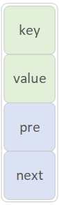
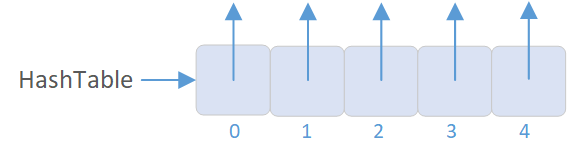
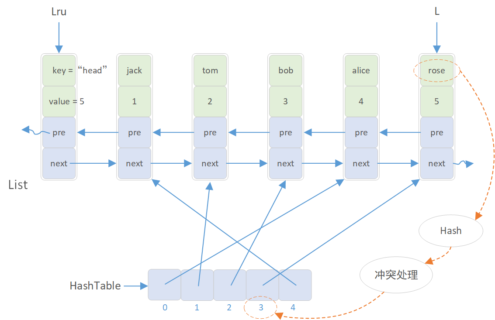
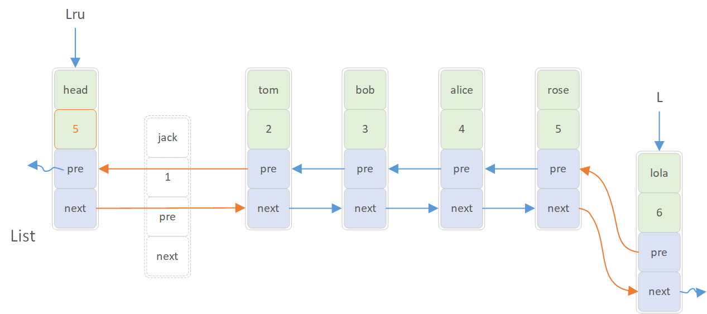
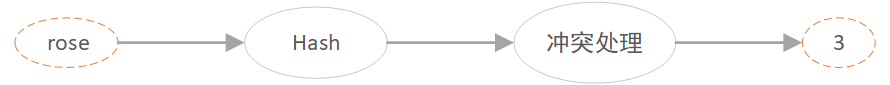
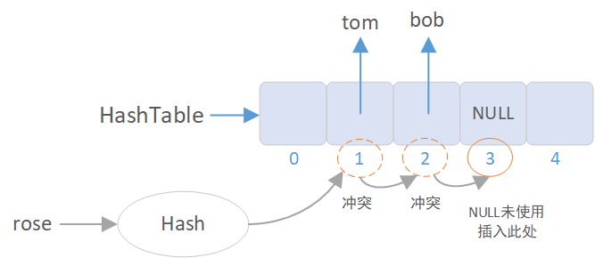
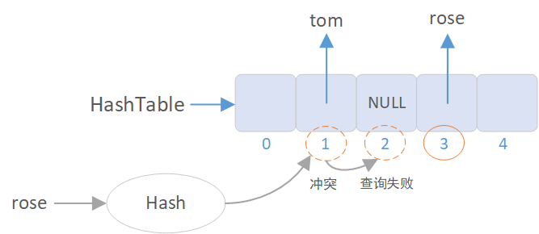
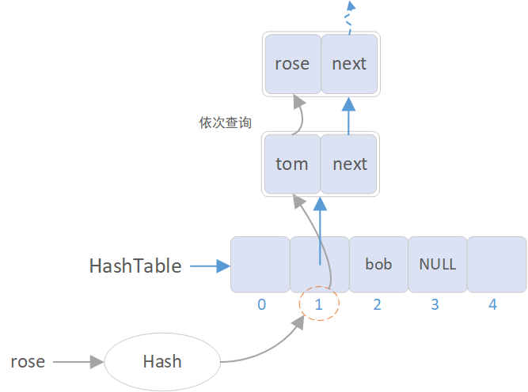

# 链表于哈希表相结合的快速表
设计可以变更的缓存结构：该结构在构造时确定大小，假设长度 len，且有两个功能：  
int set（string key，int value）：将记录（key，value）插入该结构  
int get（string key）：返回key对应的value  
要求：  
1. set和get时间复杂度为O(1)  
2. 某个key的set/get操作一旦发生，认为这个key成为最常使用的（默认这一步也是O(1) ）  
3. 当缓存大小超过k时，移除最不常用的记录。  

### 思路：

第1点，set 和 get 的时间复杂度要为O(1)，数组虽然可以实现 get O(1)，但 set 则需要移动大量元素，无法满足，链表可以实现 set O(1)，但 get 无法满足，但可以结合**哈希表**来进行辅助。同时可以看到关键字 key 的数据类型为字符串，所以需要选用字符串到无符号整型的哈希算法。

第2点，某个key的 set 和 get 使用后列为最常用，则仅在尾部 set，同时将 get 操作的节点移动到尾位置即可。但对于 O(1) 的移动，由于需要定位待移动节点的前继节点，但又不能采用从头节点往后依次查询的方法（复杂度 > O(1)），则只能采用**双向链表**。

第3点，超过k时移除最不常用，则可借鉴队列的思想，尾部插入，头部删除即可，所以时刻有两个指针，一个指向头节点，一个指向尾节点。

> 静态链表作为一种特殊的数组结构，结合哈希表应该也可以实现，等以后有时间再试吧...

## 1 结构

首先需要根据思路，需要构建两种结构：（1）链表结构 List；（2）哈希表 HashTable

对于链表，可以设计其节点结构如下：（1）关键字 key，用于存放字符串；（2）值 value；（3）pre 指针，指向该节点的前继；（4）next 指针，指向该节点的后继。 

<p align="center"></p>  
<p align="center" style="color:orange; font-size:14px; color: #999; " >图1 链表的节点结构</p>

程序表示为：

```c++
typedef struct Node  
{  
    char *key;  
    int value;  
    struct Node *pre;  
    struct Node *next;  
} Node;  
```

而对于哈希表，因为需要保存上述节点信息，则需定义为指针数组

<p align="center"></p>  
<p align="center" style="color:orange; font-size:14px; color: #999; " >图2 哈希表结构</p>

程序定义如下：

	Node **HashTable;

将两种结构结合，即可得到完整的**快速表**结构（暂称为“快速表”吧）

<p align="center"></p>  
<p align="center" style="color:orange; font-size:14px; color: #999; " >图3 快速表整体结构</p>

上图中，称第一个节点为头节点，key 为 head，value 储存链表长度，Lru指针指向头节点，不改变。而 L 指针则一直指向尾节点，随着 List 的增加而实时移动。

> 【注】：List 代表整个链表结构，只是名称，指向链表头节点的则是 Lru 指针，而 HashTable 则就是一个指向指针的指针，同时代表整个哈希表。

至于哈希索引值的计算，可分为图中所示的两步，后面会详说...


## 2 List 的插入（set）

链表长度最大为 k ，（直接定义k不太好）程序中定义为常量 L_LEN，同时对关键字 key 也进行一下限制，长度最大为S_LEN。

	const int L_LEN;	// 快速表的最大长度 
	const int S_LEN;	// 关键字 key 的最大有效字节数

此处涉及三点：  

1. List 的长度 < L_LEN 时，尾部的插入，这个没什么好说的，创捷节点，指针连接即可；
2. 当 List 的长度 > L_LEN 时，尾部插入的同时，还需要释放第一个节点；
3. List 插入或删除的同时，还需要在哈希表中进行同步操作。

插入操作如图所示，第（1）种只需要尾端插入即可，第（2）种则还需释放第一个节点。

> 【注】：（1）插入前需要进行 key 重复检查，已经有了就不要再插了；（2）修改节点的同时，还要同时修改链表长度值，在头节点的 value 变量中储存。

<p align="center"></p>
<p align="center" style="color:orange; font-size:14px; color: #999; " >图4 List的插入</p>


## 3 Hash表的建立

List 中每插入一个新节点（head节点除外），哈希表也需要同步更新。

哈希表不同于 List，属于数组结构，所以需要在建立时直接开辟所需长度，也就是 List 的最大长度 L_LEN

而对于哈希索引值计算，则是通过下图所示的计算过程

<p align="center"></p>
<p align="center" style="color:orange; font-size:14px; color: #999; " >图5 哈希索引计算</p>

以"rose"为例：

（1）首先需要计算字符串 rose 的哈希值，得到哈希值后再以该哈希值为索引，在哈希表 HashTable 中插入 rose 节点的地址。

> 此处对于字符串的Hash值计算使用的是 BKDRHash 算法，同时使计算结果对 L_LEN 取余，保证值都在 Hash 表中

（2）同时进行冲突检查，如果与已有哈希值冲突，则还需进行冲突处理，找到未使用的内存进行插入。

例如如 rose 和 tom 经计算后的哈希值都为 1，但 tom 已经率先插入了，故哈希值只能往后再挪一步，不过发现 2 又和 bob 冲突了，没办法，再挪一次，发现位置 3 为 NULL，赶紧插入。

<p align="center"></p>
<p align="center" style="color:orange; font-size:14px; color: #999; " >图6 冲突处理</p>

> ### 查询问题 
> 因为在上步插入操作时，还需要进行 key 重复性检查，而对于要实现 O(1) 的插入，key 重复检查肯定也不能通过依次遍历哈希表的方式

> 程序中，则需要通过如下代码来进行判断（此处采用的是 开放定址法的线性探测 方法进行移动，当然也可以选用其他如 二次探测之类的，此处从简了）：

```c++  
hash = BKDRHash(key);    // 第一次得到的 key 的哈希值  
hash_bak = hash;  
// 如果不符，则证明之前存在冲突情况，地址已移动到其他地方，需再次移动查找  
while( strcmp( HashTable[hash]->key, key) )  
{  
    hash = (hash + 1) % LEN;            // 开放定址法的线性探测  
    // 如果没有查询到或循环回到原点，则说明关键字不存在  
    if ( HashTable[hash] == NULL || hash == hash_bak )         
        return false;  
}
```

> 可见，如果没有查询到（移动到了 NULL），或回到原点（hash == hash_bak）则说明 key 不存在  
> **但如果两个索引值中间隔了一个 NULL 呢！？**
> 不可能！
> 因为哈希表特有的插入方式决定了 **第一次计算出的哈希索引值** 和 **最后插入位置的索引值** 之间一定没有 NULL（如上图所示），要么第一次Hash计算就得到了最终的索引，要么进行冲突检查往后移动，但冲突检查的前提就是该位置不为 NULL（被其他节点占据），所以 **第一次计算出的哈希索引值** 和 **最后插入位置的索引值** 之间一定没有 NULL。也就是说这种查询方法可以使用，且因为第一次Hash计算已经基本定位了 key 的索引值，所以复杂度为 O(1)，（当然，最坏的情况是移动所有，为 O(n) ）

> 还有一种情况是在 **List 长度已满时的插入**，虽然删除第一个节点时的那一刻，可能会导致产生 NULL，但插入的新节点又会重新填补，所以依然没问题。
 
> **但是！**  

> 如果仅进行删除的操作，那么就有可能导致错误的查询失败发生

> 接上个例子，再成功插入 rose 后，如果这时再执行一个 bob 的删除操作，则位置 2 被置 NULL。此时执行 rose 的查询操作，在经过一次冲突检查后到达位置 2 后，就会直接判定查询失败，无 rose。出现Bug。
> <p align="center"></p>
> <p align="center" style="color:orange; font-size:14px; color: #999; " >图7 查询问题</p>
> 所以，对于这种结构的哈希表，想实现 O(1) 的查询就不能实现单一删除的操作，不过本文最开始就表明只针对 O(1) 的 set 和 get，所以该结构可以满足要求。

> **但我既要 O(1) 查询，又要删除功能怎么办呢？**

> 那就得换哈希表的结构了，比如下面这种**链地址法**，不存在上述问题。

> <p align="center"></p>
> <p align="center" style="color:orange; font-size:14px; color: #999; " >图8 哈希表的链地址法</p>

> 但首先有会有部分内存浪费，而且链表结构也会增加查询开销...，所以具体情况还需具体分析

## 4 List 的查找（get）

因为 get 操作过的节点需作为最常使用的节点，所以这个本质上是上述的**查询 + 插入**

对于查询，得到最终的 Hash 索引地址后再将对应节点的 value 取出来即可

而插入，就是得将该节点重新插入到 List 的尾部。

> 注：将该节点重新插入到尾部仅涉及指针的修改，并不释放节点，所以哈希表不需要任何修改。

## 5 实现

程序采用 C++ 编写，运行结果示例：

设定 L_LEN = 5，即 List 最大长度为 5

第一个表，从上往下依次为头节点 head, 第1个...第5个节点，括号里面是其对应的 value 值（head节点的 value 储存 List 长度）。

第二个表，从上往下依次为哈希表的内容，0, 1, ... 5 分别指向不同的节点，即代表不同节点的哈希索引值。

(截图插入无法显示，可在`Pictures\9.PNG`中查看)  

```
========== List ==========  
||  head(len: 5)  
||    ↓↑  
||  jack(1)  
||    ↓↑  
||  tom(2)  
||    ↓↑  
||  bob(3)  
||    ↓↑  
||  alice(4)  
||    ↓↑  
||  rose(5)  
===========================  
------- HashTable -------  
||  0 → alice  
||  1 → tom  
||  2 → bob  
||  3 → rose  
||  4 → jack  
-------------------------  
```


# 参考文章

《大话数据结构》- 程杰

[各种字符串Hash函数（转）](https://www.cnblogs.com/zl1991/p/11820922.html) 


